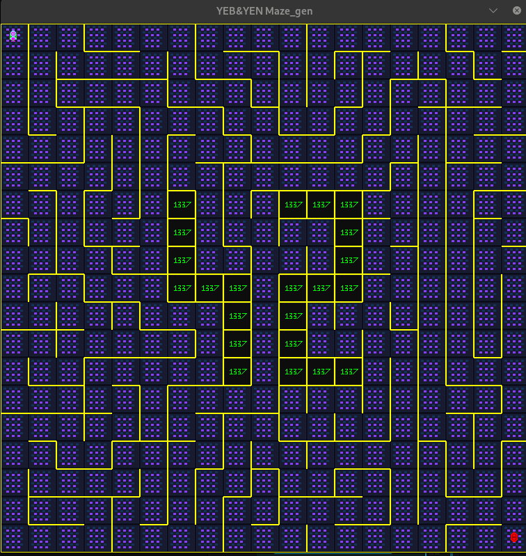

*This project has been created as part of the 42 curriculum by yousenna, yoelboud.*

# 🧩 A-Maze-ing

<p align="center">
  
</p>

A maze generation and visualization project built with Python and MiniLibX. Generate perfect mazes using classic algorithms, navigate through them interactively, and find the shortest path from entry to exit.

---

## 📋 Table of Contents

- [Description](#-description)
- [Features](#-features)
- [Instructions](#-instructions)
  - [Requirements](#requirements)
  - [Installation](#installation)
  - [Running the Program](#running-the-program)
- [Configuration File](#-configuration-file)
- [Maze Generation Algorithms](#-maze-generation-algorithms)
- [Reusable Code](#-reusable-code)
- [Controls](#-controls)
- [Project Structure](#-project-structure)
- [Team & Project Management](#-team--project-management)
- [Resources](#-resources)
- [Authors](#-authors)

---

## 📖 Description

**A-Maze-ing** is a maze generation and pathfinding visualization tool developed as part of the 42 curriculum. The project demonstrates:

- **Maze Generation**: Create random mazes using two different algorithms
- **Pathfinding**: Find the shortest path using BFS (Breadth-First Search)
- **Interactive Visualization**: Navigate through the maze using keyboard controls
- **42 Pattern**: Special "42" pattern embedded in mazes (when size permits)

The program reads configuration from a file, generates a maze based on specified parameters, renders it using MiniLibX graphics library, and allows users to interactively explore or solve the maze.

---

## ✨ Features

- **Two Maze Generation Algorithms**: Recursive Backtracker and Prim's Algorithm
- **Perfect Maze Generation**: Every maze has exactly one solution
- **Interactive Navigation**: Move through the maze with arrow keys
- **Path Visualization**: Display the shortest path from current position to exit
- **Maze Regeneration**: Generate new mazes on the fly
- **Color Customization**: Change wall colors randomly
- **42 Pattern Integration**: Special 42 logo pattern embedded in larger mazes
- **Output File Generation**: Save maze structure to text file

---

## 📦 Instructions

### Requirements

- Python 3.x
- Linux/Unix environment (for MiniLibX)
- X11 display server

### Installation

1. **Clone the repository:**
   ```bash
   git clone https://github.com/Roy-ALPHA/A-mazing-guide.git
   cd A-mazing-guide
   ```

2. **Install dependencies using Make:**
   ```bash
   make install
   ```
   This will:
   - Create a virtual environment (`venv`)
   - Install required packages from `requirements` file
   - Install MiniLibX Python wheel

### Running the Program

**Using Make (recommended):**
```bash
make run
```

**Or manually:**
```bash
./venv/bin/python3 a_maze_ing.py config/config.conf
```

**Debug mode:**
```bash
make debug
```

**Linting:**
```bash
make lint         # Basic linting
```

**Clean up:**
```bash
make clean
```

---

## ⚙️ Configuration File

The configuration file (`.conf` or `.txt`) defines maze parameters. Here's the complete structure:

```properties
# Configuration file for A-Maze-ing

# Width of maze (columns)
# Range: 6 - 48
WIDTH = 19

# Height of maze (rows)
# Range: 6 - 25
HEIGHT = 19

# Entry point coordinates (x, y)
# Must not be on 42 pattern or out of range
ENTRY = 0, 0

# Exit point coordinates (x, y)
# Must not be on 42 pattern or overlap with Entry
EXIT = 18, 18

# Output file for maze structure (must be .txt)
OUTPUT_FILE = maze.txt

# Seed for reproducible maze generation
# True = same maze every time, False = random
SEED = False

# Maze generation algorithm
# True = Recursive Backtracker (perfect maze)
# False = Prim's Algorithm
PERFECT = True
```

### Configuration Parameters

| Parameter | Type | Range/Values | Description |
|-----------|------|--------------|-------------|
| `WIDTH` | Integer | 6 - 48 | Number of columns in the maze |
| `HEIGHT` | Integer | 6 - 25 | Number of rows in the maze |
| `ENTRY` | Tuple | `x, y` | Starting point coordinates |
| `EXIT` | Tuple | `x, y` | Goal point coordinates |
| `OUTPUT_FILE` | String | `*.txt` | File to save maze output |
| `SEED` | Boolean | `True/False` | Enable reproducible generation |
| `PERFECT` | Boolean | `True/False` | Algorithm selection |

---

## 🔧 Maze Generation Algorithms

### 1. Recursive Backtracker Algorithm (`PERFECT = True`)

**How it works:**
1. Start at a random cell and mark it as visited
2. While there are unvisited cells:
   - If current cell has unvisited neighbors:
     - Choose a random unvisited neighbor
     - Remove the wall between current and chosen cell
     - Move to the chosen cell and mark it visited
     - Push current cell to stack
   - Else:
     - Pop a cell from the stack and backtrack

**Why we chose it:**
- **Generates perfect mazes**: Every maze has exactly one solution with no loops
- **Long, winding passages**: Creates aesthetically pleasing mazes with long corridors
- **Simple implementation**: Easy to understand and implement recursively
- **Consistent quality**: Always produces solvable, challenging mazes

### 2. Prim's Algorithm (`PERFECT = False`)

**How it works:**
1. Start with a grid full of walls
2. Pick a random cell, mark it as part of the maze
3. Add the cell's neighbors to a "frontier" list
4. While the frontier is not empty:
   - Pick a random frontier cell
   - Connect it to a random adjacent cell already in the maze
   - Add its unvisited neighbors to the frontier

**Why we chose it:**
- **Different maze characteristics**: Creates mazes with more branching patterns
- **Randomized structure**: More unpredictable maze layouts
- **Alternative experience**: Provides variety compared to Backtracker

---

## ♻️ Reusable Code

### `maze/mazegen.py` - MazeGenerator Class
The core maze generation logic is modular and reusable:

```python
from maze.mazegen import MazeGenerator

# Create a maze generator
maze = MazeGenerator(width=20, height=20, Entry=(0,0), EXIT=(19,19), out_file="output.txt")

# Generate using Backtracker
maze.creat_maze_bakctracker_algo()

# Or generate using Prim's
maze.creat_maze_prims_algo()

# Access the maze grid
grid = maze.maze  # 2D list of Cell objects
```

### `maze/pathfinder.py` - BFS Pathfinding
The pathfinder module can be used independently:

```python
from maze.pathfinder import pathfinder

# Find shortest path
path = pathfinder(maze_grid, entry=(0,0), exit=(19,19), width=20, height=20)
# Returns list of (x, y) coordinates
```

### `configs/config_parser.py` - Configuration Parser
Reusable for any key-value configuration file:

```python
from configs.config_parser import parser

configs = parser("config.conf")
# Returns dictionary with parsed and validated values
```

---

## 🎮 Controls

| Key | Action |
|-----|--------|
| `↑` `↓` `←` `→` | Move player through the maze |
| `P` | Show path from current position to exit |
| `G` | Generate a new maze |
| `H` | Hide path (clear arrows) |
| `C` | Change wall color |
| `ESC` | Exit the program |

---

## 📁 Project Structure

```
a_maze/
├── a_maze_ing.py          # Main entry point
├── Makefile               # Build automation
├── requirements           # Python dependencies
├── config/
│   └── config.conf        # Default configuration
├── configs/
│   ├── __init__.py
│   └── config_parser.py   # Configuration file parser
├── maze/
│   ├── __init__.py
│   ├── mazegen.py         # Maze generation algorithms
│   └── pathfinder.py      # BFS pathfinding algorithm
├── render/
│   ├── __init__.py
│   └── render.py          # MiniLibX rendering
├── utils/
│   ├── __init__.py
│   └── errors.py          # Custom exceptions
├── assets/                # XPM image assets
│   ├── arrow_*.xpm        # Direction arrows
│   ├── maze_bg_40.xpm     # Background tile
│   ├── path_*.xpm         # Path markers
│   ├── player_idle1.xpm   # Player sprite
│   └── wall_1337_neon.xpm # 42 pattern wall
└── wheels/
    └── mlx-2.2-py3-none-any.whl  # MiniLibX Python binding
```

---

## 👥 Team & Project Management

### Team Roles

| Member | Role | Responsibilities |
|--------|------|------------------|
| **yousenna** | Maze Generation & Infrastructure | `mazegen.py`, `Makefile`, output file generation, README documentation |
| **yoelboud** | Rendering & Application Logic | `render.py`, `pathfinder.py`, `config_parser.py`, `errors.py`, main application |

### Project Planning

**Initial Planning:**
- `day 1` : Research algorithms, set up project structure
- `days 2, 3, 4` : Implement maze generation (Backtracker & Prim's)
- `days `5, 6`: Implement rendering and pathfinding
- `day 4`: Integration, testing, and documentation

**How it Evolved:**
- The 42 pattern feature was added mid-project as an enhancement
- Interactive controls were expanded based on testing feedback
- Configuration validation was strengthened after edge case discoveries

### What Worked Well
- ✅ Clear separation of concerns (generation, rendering, configuration)
- ✅ Regular code reviews and pair programming sessions
- ✅ Using Make for build automation simplified development
- ✅ Modular design made testing individual components easy

### What Could Be Improved
- 📝 Earlier integration testing would have caught interface issues sooner
- 📝 More comprehensive error messages for edge cases
- 📝 Unit tests could be added for better code coverage

### Tools Used
- **Version Control**: Git & GitHub
- **IDE**: Visual Studio Code
- **Linting**: flake8, mypy
- **Debugging**: pdbpp
- **Graphics**: MiniLibX (Python binding)
- **Communication**: Discord for team coordination

---

## 📚 Resources

### Documentation & References
- [Maze Generation Algorithms - Wikipedia](https://en.wikipedia.org/wiki/Maze_generation_algorithm)
- [Recursive Backtracker - Jamis Buck](http://datagenetics.com/blog/november22015/index.html)
- [Prim's Algorithm Visualization](https://weblog.jamisbuck.org/2011/1/10/maze-generation-prim-s-algorithm)
- [BFS Pathfinding - GeeksforGeeks](https://www.geeksforgeeks.org/breadth-first-search-or-bfs-for-a-graph/)
- [MiniLibX Documentation](https://harm-smits.github.io/42docs/libs/minilibx)
- [Python Type Hints - mypy](https://mypy.readthedocs.io/)

### AI Usage Disclosure
AI tools were used in this project for:
- **Code Documentation**: Generating docstrings and inline comments
- **README Generation**: Structuring and formatting this documentation
- **Debugging Assistance**: Identifying issues with mypy configuration and linting setup
- **Code Review**: Suggesting improvements for type hints and error handling

All core algorithms (maze generation, pathfinding) were implemented by the team members based on algorithmic understanding from the referenced resources.

---

## 👨‍💻 Authors

<table align="center">
  <tr>
    <td align="center">
      <a href="https://github.com/youssenna">
        
        <br />
        <sub><b>Youssef Ennajar</b></sub>
      </a>
      <br />
      <a href="https://github.com/youssenna" title="GitHub">
        
      </a>
      <a href="https://www.linkedin.com/in/youssef-ennajar-213985253/" title="LinkedIn">
        
      </a>
    </td>
    <td align="center">
      <a href="https://github.com/Roy-ALPHA">
        
        <br />
        <sub><b>Youness Elboudali</b></sub>
      </a>
      <br />
      <a href="https://github.com/Roy-ALPHA" title="GitHub">
        
      </a>
      <a href="https://www.linkedin.com/in/youness-elboudali-02681a246?utm_source=share&utm_campaign=share_via&utm_content=profile&utm_medium=android_app" title="LinkedIn">
        
      </a>
    </td>
  </tr>
</table>

---

<p align="center">
  Made with ❤️ at 1337 bengurir
</p>
